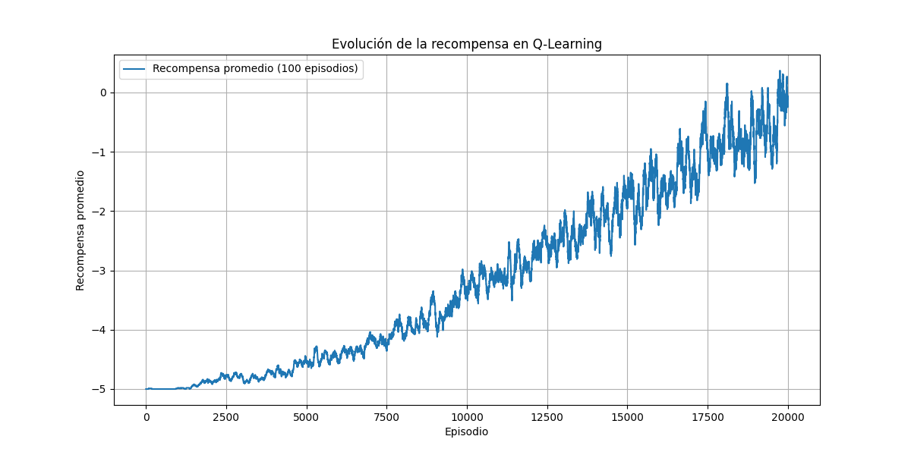
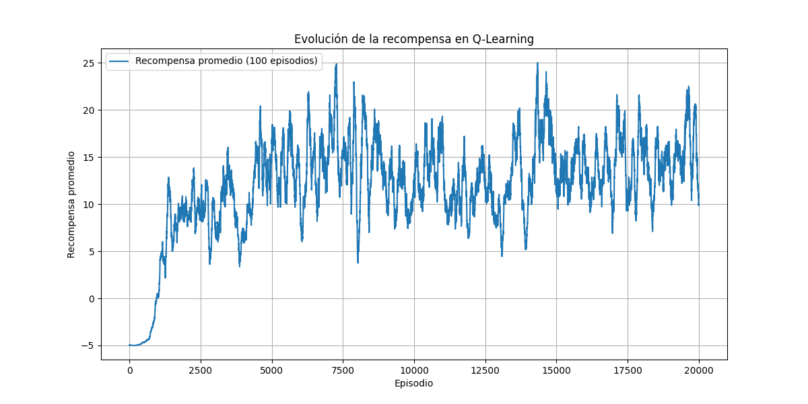
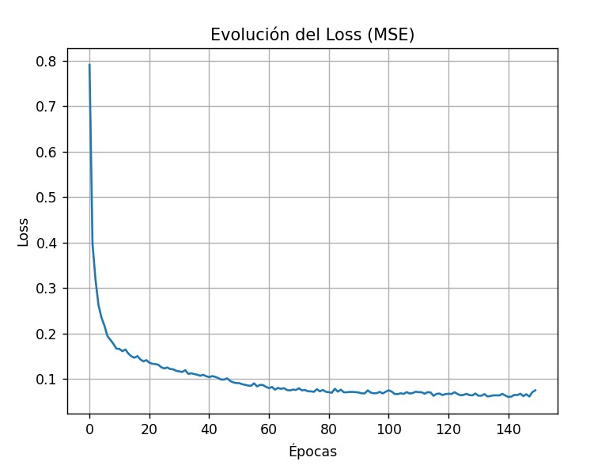
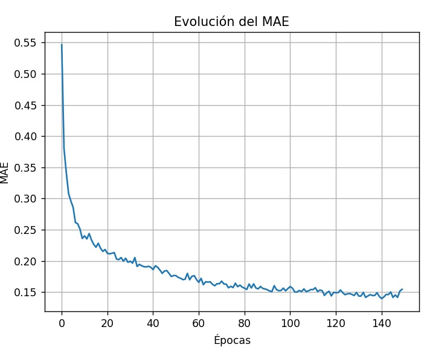
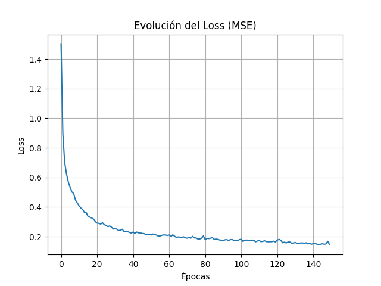
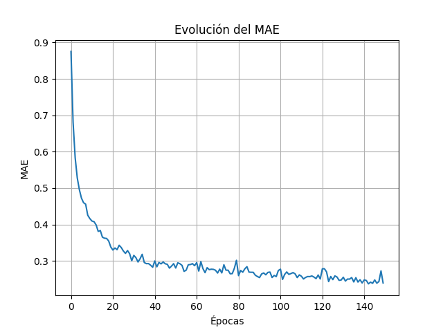
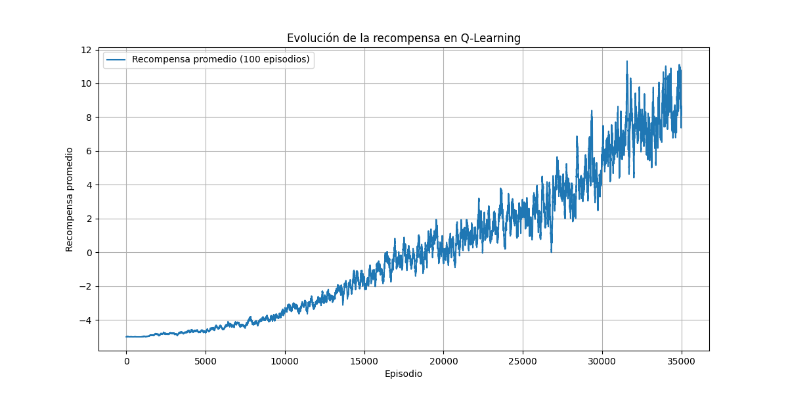
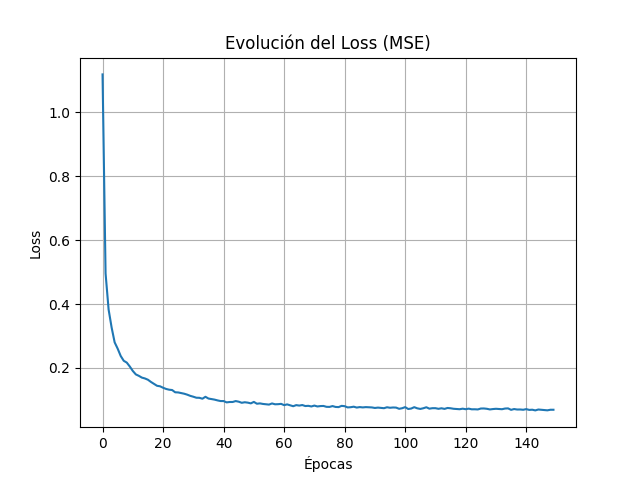
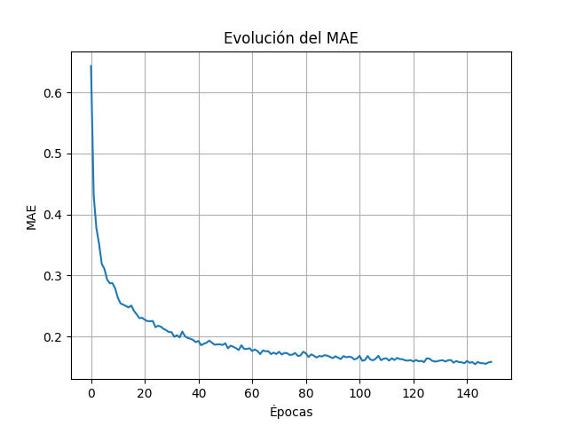

#  Flappy Bird — Ingeniería de Características y Conclusiones de los Agentes entrenados con Q-Learning y Deep Q-Learning
Para analizar el desempeño de los dos enfoques —Q-Learning basado en Q-table y Deep Q-Learning basado en redes neuronales— realizamos distintas configuraciones de discretización del espacio de estados y varios entrenamientos exploratorios. Mostramos aquí los resultados más representativos del proceso, incluyendo los intentos intermedios y las configuraciones que llevaron finalmente a obtener el mejor rendimiento en cada tipo de agente.

---

##  Ingeniería de Características (Discretización)

---

###  Estado Crudo del Juego

| Variable | Descripción |
|---------|-------------|
| `player_y` | Posición vertical del pájaro |
| `player_vel` | Velocidad vertical del pájaro |
| `next_pipe_dist_to_player` | Distancia horizontal al siguiente tubo |
| `next_pipe_top_y` | Altura del borde superior del hueco |
| `next_pipe_bottom_y` | Altura del borde inferior del hueco |

Estado crudo = 5 valores continuos seleccionados del estado completo
(*Estado completo = 8 valores*)

Como estas variables son continuas, se agrupan en **intervalos**.

---

###  Discretización implementada para cada variable:

| Variable | Sentido | Tipo de discretización |
|---------|------------|----------------------|
| `player_y` | Indica si el pájaro está muy arriba, centro o muy abajo | Se divide por *10* para agrupar rangos de altura en bins |
| `player_vel` | Importa la dirección del movimiento, no el valor exacto | Clasificada en categorías:  • Subiendo rápido  • Subiendo  • Estable  • Bajando  • Bajando rápido |
| `next_pipe_dist_to_player` | Indica urgencia; si falta mucho o está cerca el tubo | Se divide por *10* para agrupar rangos horizontales en bins |
| `next_pipe_top_y` / `next_pipe_bottom_y` | Representan dónde está el hueco | Se divide por *10* para agrupar rangos de altura en bins |

###  Representación Final del Estado  
Se utiliza una **tupla de índices discretizados**, (player_y_bin, player_vel_bin, dist_to_pipe_bin, top_pipe_y_bin, bot_pipe_y_bin)

---

## Entrenamiento y evaluación 
Se generó la Q-table en base a 20000 episodios y se evaluaron ambos agentes durante 100 episodios, bajo dos tipos de discretización: baja (dividiendo las variables espaciales del estado por 10) y alta (dividiéndolas por 25).

---

### Visualización de evolución de métricas durante el entrenamiento

#### Q-Learning
Gráfico de recompensas por episodio durante el entrenamiento del agente Q-Learning:

#### Discretización baja (Más estados)

#### Discretización alta (Menos estados)

---

#### Red Neuronal (DQN)
Gráficos de la métrica de pérdida (loss) y MAE durante el entrenamiento de la red neuronal:  

#### Discretización baja (Más estados)

#### Discretización alta (Menos estados)

Observamos que la Q-table aprende más rápido con un espacio de estados menor y alcanza recompensas promedio más altas. Con la discretización baja necesita más episodios para alcanzar valores de recompensas promedio más altos y estables. Esto se debe a que la exploración disminuye por episodios, generando que el porcentaje de exploración llegue a su mínimo rápidamente sin tener la tabla los conocimientos de explotación necesarios. Una posible solución a este problema es disminuir el porcentaje de exploración según las recompensas obtenidas.

---

### Comparación de resultados

Episodios de entrenamiento Q-table: 20000

| Agente / Método       | Recompensa promedio (baja discretización) | Recompensa promedio (alta discretización) | Recompensa promedio (baja discretización en NNAgent y alta discretización en QAgent)|
|-----------------------|------------------------------------------|-------------------------------------------|------------------------------------------------------------------------------------------|
| Q-Learning (Q-table)  | **31**                                       | 7                                     |        |
| Red Neuronal (DQN)    | 16                                       | 23                                        | **32**  |

*A su vez por en una prueba fallida en la cual fijamos discretizaciones distintas para los dos agentes, alta para el agente Q-Learning y baja para el agente DQN, obtuvimos una recompensa promedio de **32***

---

## Entrenamiento y evaluación (35000 episodios)
Resultados de aumentar a 35000 el número de episodios durante el entrenamiento de Q-Learning.

---

### Visualización de evolución de métricas durante el entrenamiento (35000 episodios)

#### Q-Learning
Gráfico de recompensas por episodio durante el entrenamiento del agente Q-Learning:  

#### Red Neuronal (DQN)
Gráficos de la métrica de pérdida (loss) y MAE durante el entrenamiento de la red neuronal:  

---

### Comparación de resultados (35000 episodios)

| Agente / Método       | Recompensa promedio (baja discretización) |
|-----------------------|------------------------------------------|
| Q-Learning (Q-table)  | 63                                       |
| Red Neuronal (DQN)    |                                       | 

Observamos que  el agente basado en Q-Learning logró un mejor desempeño promedio en comparación con el agente basado en red neuronal en este experimento, cuando la discretización es la correcta (baja en este caso) y la cantidad de episodios en train son suficientes. Por otro lado la red neuronal genera un mejor desempeño cuando la Q table no es precisa, producto de una discretización muy dura o la falta de episodios en el entrenamiento, a causa de su capacidad de generalización.

---

## Comentarios finales

- La Q-table demostró ser efectiva para este juego debido al bajo número de variables discretizadas, teniendo un mejor desempeño con la discretización baja para las variables espaciales. Demostró una mejora significativa de rendimiento al aumentar el número de episodios de entrenamiento. La Q-Table tiene un proceso de aprendizaje lento, con el número de episodios necesarios para el entrenamiento, la tabla conoce todos los estados y tiene un desempeño casi perfecto.
- La red neuronal obtiene un mejor desempeño cuando la discretización es alta (pocos estados), donde la Q-table muestra mucho ruido. Esto ocurre porque la Q-table solo memoriza cada estado discretizado de forma independiente y pierde mucha información al agrupar tantos estados continuos en el mismo bin. En cambio, la red neuronal puede generalizar entre estados parecidos, suavizar la función de recompensa y encontrar patrones. Por eso, aun usando la misma Q-table como base, la red logra resultados más estables y efectivos en ese escenario.
- Aunque utilizar discretizaciones distintas entre la Q-table y la red neuronal no es conceptualmente correcto (porque ambas aprenden sobre espacios de estados diferentes), en la práctica los buenos resultados obtenidos por el agente con red neuronal se explican por su capacidad para generalizar y aproximar mejor la salida cuando el espacio de estados es más fino.
Mientras la Q-table le permite a la red neuronal aprender relaciones útiles entre las variables aun con una representación más gruesa del entorno, la mayor cantidad de estados (producto de la discretización baja) le permite alcanzar un desempeño superior al observado con discretización alta.

